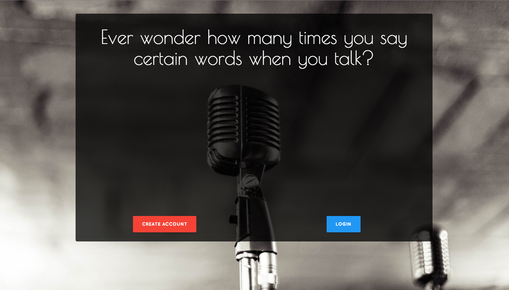

# WDI Project 4: Speech-To-Text

https://speech-to-text-app.herokuapp.com/

### Objective

Create a web application that will help you improve your public speaking skills by telling how many times you say/repeat certain words, such as "like" and "um, in your speech. ("um" does not work, yet)

### Installation

* Run an npm install in the terminal
* In server.js, remove "process.env.DB_URL" and replace it with 'mongodb://localhost/speech-to-text'
* Run mongodb in the terminal (install if not already on your machine)

### Project Requirements

The guidelines listed below were provided by the project markdown:

* Build a full-stack application by making your own backend and your own front-end
* Have an API of your design
* Have an interactive front-end, preferably using a modern front-end framework
* Be a complete product, which most likely means multiple relationships and CRUD functionality for at least a couple models
* Use a database, whether that's one we've covered in class or one you want to learn
* Implement thoughtful user stories that are significant enough to help you know which features to build and which to scrap
* Have a visually impressive design to kick your portfolio up a notch and have something to wow future clients & employers
* Be deployed online so it's publicly accessible

### MVP

* Users can create an account, then edit or delete their account
* Users can reset their password if they forget it
* Users can record their voice and the app will transcribe their speech as they speak, and then log how many times the keywords were said
* Users can save their speeches to a database and then retrieve them later
* Users can delete their speeches after they have been saved

### Technologies/Frameworks used

* HTML5
* CSS3
* Javascript
* jQuery
* EJS
* AJAX
* Nodemailer
* Node.js
* Express.js
* MongoDB
* mLabs
* p5.js
* p5.speech
* Passport

### Major hurdles/problems

1. IBM Watson Speech-to-text configuration
2. Passport
3. DOM manipulation
4. Nodemailer code for password reset

### Future Implementations

* Improve CSS styling
* Add ability to upload an audio file to be transcribed
